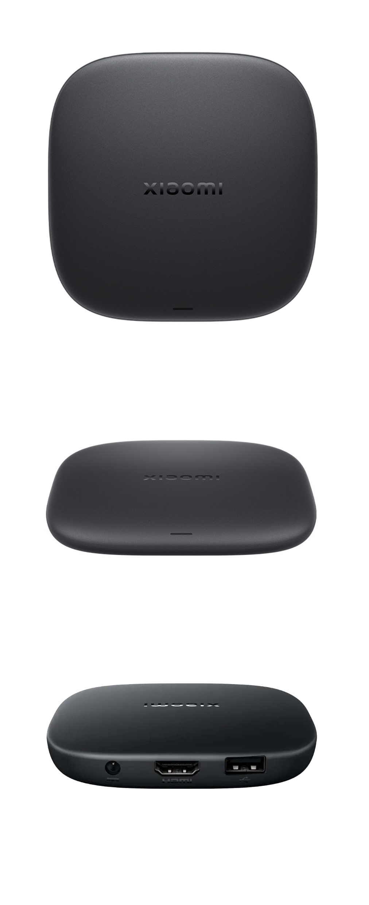
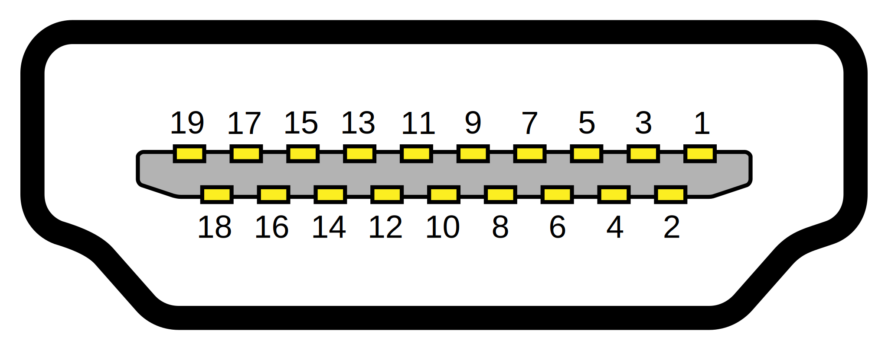

# 小米盒子 5 (MOB2MB-5P)

> [!NOTE]
> ### 注意
> - 本文档中的设备信息基于作者自有设备及官方公开资料整理。
> - 不同批次或渠道的设备在系统版本、硬件或外观上可能存在差异，相关内容仅供参考，请以实际情况为准。

## 目录
- [规格参数](#规格参数)
- [额外信息](#额外信息)
- [设备外观](#设备外观-来自于官方)
- [主板照片](#主板照片)
- [内部部分元器件特写](#内部部分元器件特写)
- [Android 分区信息](#android-分区信息)
- [UART连接信息](#uart连接信息)
- [Root / 备份教程](#root--备份教程)

## 规格参数
- 操作系统：Xiaomi HyperOS (Android 14)
- SoC：Amlogic S905X5M
- CPU：四核 Cortex-A55 (最高主频 2.5 GHz)
- GPU：ARM Mali-G310 V2
- RAM：2GB
- ROM：32GB
- 蓝牙：5.2
- 无线网络：Wi-Fi 6 (2.4GHz/5GHz)
- 尺寸：97 x 97.1 x 17 mm
- 重量：91.6 g
- USB 2.0 x 1
- HDMI x 1

_※ 说明：规格参数信息来自于官方_

## 额外信息
- 设备代号：darkknight
- 系统内显示型号：MiTV-AZFU0
- 出厂系统版本：UD2A.240505.001.W1.OS2.0.7.0.UZFAABX
- 出厂内核版本：5.15.153-android14-11-gf80308c320bc-abOS2.0.7.0.UZFAABX
- 指纹: Xiaomi/darkknight/darkknight:14/UD2A.240505.001.W1/OS2.0.7.0.UZFAABX:user/release-keys
- 出厂安全补丁级别：2024-11-01
- 出厂 Bootloader 版本：01.01.250317.222939

_※ 说明：此处的信息均来自于作者自己的设备，不同生产批次或销售渠道的设备，其预装的系统版本可能存在差异，相关内容仅供参考，请以实际情况为准。_

## 设备外观 (来自于官方)

<details>

<summary>点击此处来查看照片</summary>



_※ 说明：由于官方并未提供 小米盒子5 的接口照片，因此接口照片来自于与 小米盒子5 外观一样的 Xiaomi TV Box S (3rd Gen)，照片仅供参考，请以实物为准。_
</details>

## 主板照片

### 主板正面 (屏蔽罩未移除)
<details>

<summary>点击此处来查看照片</summary>


</details>

### 主板正面
<details>

<summary>点击此处来查看照片</summary>


</details>

### 主板反面 (屏蔽罩未移除)
<details>

<summary>点击此处来查看照片</summary>


</details>

### 主板反面
<details>

<summary>点击此处来查看照片</summary>


</details>

## 内部部分元器件特写

### SoC：晶晨 S905X5M
<details>

<summary>查看 SOC 特写</summary>


</details>

### eMMC：长江存储 YMEC6A2TB1A2C3
<details>

<summary>查看 eMMC 特写</summary>


</details>

### RAM：南亚 NT5AD512M16C4-JR
<details>

<summary>查看 RAM 特写</summary>


</details>

### Wifi+BT模块：欧智通 K265B-UU
<details>

<summary>查看 Wifi+BT模块 特写</summary>


</details>

## Android 分区信息

> [!NOTE]
> ### 注意
> 此处提供的信息仅供参考，请以实际设备为准。
> 
> 提取版本: UD2A.240505.001.W1.OS2.0.7.0.UZFAABX


| 分区号 | 起始扇区 | 结束扇区 | 大小   | 大小(字节)  |  分区名称        | 设备节点      |
| -- | ------- | -------- | -------- | ----------- | --------------- | ------------ |
| 1  | 73728   | 204799   | 64.0 MiB | 67108864    | reserved        | mmcblk0p1    |
| 2  | 221184  | 237567   | 8.0 MiB  | 8388608     | env             | mmcblk0p2    |
| 3  | 270336  | 274431   | 2.0 MiB  | 2097152     | frp             | mmcblk0p3    |
| 4  | 290816  | 307199   | 8.0 MiB  | 8388608     | factory         | mmcblk0p4    |
| 5  | 309248  | 440319   | 64.0 MiB | 67108864    | vendor_boot_a   | mmcblk0p5    |
| 6  | 442368  | 573439   | 64.0 MiB | 67108864    | vendor_boot_b   | mmcblk0p6    |
| 7  | 575488  | 591871   | 8.0 MiB  | 8388608     | bootloader_a    | mmcblk0p7    |
| 8  | 593920  | 610303   | 8.0 MiB  | 8388608     | bootloader_b    | mmcblk0p8    |
| 9  | 612352  | 677887   | 32.0 MiB | 33554432    | tee             | mmcblk0p9    |
| 10 | 679936  | 696319   | 8.0 MiB  | 8388608     | logo            | mmcblk0p10   |
| 11 | 698368  | 702463   | 2.0 MiB  | 2097152     | misc            | mmcblk0p11   |
| 12 | 704512  | 708607   | 2.0 MiB  | 2097152     | dtbo_a          | mmcblk0p12   |
| 13 | 710656  | 714751   | 2.0 MiB  | 2097152     | dtbo_b          | mmcblk0p13   |
| 14 | 716800  | 733183   | 8.0 MiB  | 8388608     | cri_data        | mmcblk0p14   |
| 15 | 735232  | 755711   | 10.0 MiB | 10485760    | factorydata     | mmcblk0p15   |
| 16 | 757760  | 790527   | 16.0 MiB | 16777216    | param           | mmcblk0p16   |
| 17 | 792576  | 825343   | 16.0 MiB | 16777216    | odm_ext_a       | mmcblk0p17   |
| 18 | 827392  | 860159   | 16.0 MiB | 16777216    | odm_ext_b       | mmcblk0p18   |
| 19 | 862208  | 927743   | 32.0 MiB | 33554432    | oem_a           | mmcblk0p19   |
| 20 | 929792  | 995327   | 32.0 MiB | 33554432    | oem_b           | mmcblk0p20   |
| 21 | 997376  | 1128447  | 64.0 MiB | 67108864    | boot_a          | mmcblk0p21   |
| 22 | 1130496 | 1261567  | 64.0 MiB | 67108864    | boot_b          | mmcblk0p22   |
| 23 | 1263616 | 1279999  | 8.0 MiB  | 8388608     | init_boot_a     | mmcblk0p23   |
| 24 | 1282048 | 1298431  | 8.0 MiB  | 8388608     | init_boot_b     | mmcblk0p24   |
| 25 | 1300480 | 1431551  | 64.0 MiB | 67108864    | metadata        | mmcblk0p25   |
| 26 | 1433600 | 1437695  | 2.0 MiB  | 2097152     | vbmeta_a        | mmcblk0p26   |
| 27 | 1439744 | 1443839  | 2.0 MiB  | 2097152     | vbmeta_b        | mmcblk0p27   |
| 28 | 1445888 | 1449983  | 2.0 MiB  | 2097152     | vbmeta_system_a | mmcblk0p28   |
| 29 | 1452032 | 1456127  | 2.0 MiB  | 2097152     | vbmeta_system_b | mmcblk0p29   |
| 30 | 1458176 | 7602175  | 2.9 GiB  | 3145728000  | super           | mmcblk0p30   |
| 31 | 7604224 | 7735295  | 64.0 MiB | 67108864    | rsv             | mmcblk0p31   |
| 32 | 7737344 | 61067263 | 25.4 GiB | 27304919040 | userdata        | mmcblk0p32   |
| -  | -       | -        | 4.0 MiB  | 4194304     | -               | mmcblk0boot0 |
| -  | -       | -        | 4.0 MiB  | 4194304     | -               | mmcblk0boot1 |

### 分区信息来源

<details>

<summary>点击此处来查看</summary>

```shell
$ sgdisk --print /dev/block/mmcblk0
Disk /dev/block/mmcblk0: 61071360 sectors, 29.1 GiB
Sector size (logical/physical): 512/512 bytes
Disk identifier (GUID): 55A297A3-BE53-7911-A213-E9E22D518E1F
Partition table holds up to 32 entries
Main partition table begins at sector 2 and ends at sector 9
First usable sector is 34, last usable sector is 61071326
Partitions will be aligned on 2048-sector boundaries
Total free space is 200637 sectors (98.0 MiB)

Number  Start (sector)    End (sector)  Size       Code  Name
   1           73728          204799   64.0 MiB    0700  reserved
   2          221184          237567   8.0 MiB     0700  env
   3          270336          274431   2.0 MiB     0700  frp
   4          290816          307199   8.0 MiB     0700  factory
   5          309248          440319   64.0 MiB    0700  vendor_boot_a
   6          442368          573439   64.0 MiB    0700  vendor_boot_b
   7          575488          591871   8.0 MiB     0700  bootloader_a
   8          593920          610303   8.0 MiB     0700  bootloader_b
   9          612352          677887   32.0 MiB    0700  tee
  10          679936          696319   8.0 MiB     0700  logo
  11          698368          702463   2.0 MiB     0700  misc
  12          704512          708607   2.0 MiB     0700  dtbo_a
  13          710656          714751   2.0 MiB     0700  dtbo_b
  14          716800          733183   8.0 MiB     0700  cri_data
  15          735232          755711   10.0 MiB    0700  factorydata
  16          757760          790527   16.0 MiB    0700  param
  17          792576          825343   16.0 MiB    0700  odm_ext_a
  18          827392          860159   16.0 MiB    0700  odm_ext_b
  19          862208          927743   32.0 MiB    0700  oem_a
  20          929792          995327   32.0 MiB    0700  oem_b
  21          997376         1128447   64.0 MiB    0700  boot_a
  22         1130496         1261567   64.0 MiB    0700  boot_b
  23         1263616         1279999   8.0 MiB     0700  init_boot_a
  24         1282048         1298431   8.0 MiB     0700  init_boot_b
  25         1300480         1431551   64.0 MiB    0700  metadata
  26         1433600         1437695   2.0 MiB     0700  vbmeta_a
  27         1439744         1443839   2.0 MiB     0700  vbmeta_b
  28         1445888         1449983   2.0 MiB     0700  vbmeta_system_a
  29         1452032         1456127   2.0 MiB     0700  vbmeta_system_b
  30         1458176         7602175   2.9 GiB     0700  super
  31         7604224         7735295   64.0 MiB    0700  rsv
  32         7737344        61067263   25.4 GiB    0700  userdata

$ ls -l /dev/block/by-name
total 0
lrwxrwxrwx 1 root root 21 1969-12-31 19:00 boot_a -> /dev/block/mmcblk0p21
lrwxrwxrwx 1 root root 21 1969-12-31 19:00 boot_b -> /dev/block/mmcblk0p22
lrwxrwxrwx 1 root root 20 1969-12-31 19:00 bootloader_a -> /dev/block/mmcblk0p7
lrwxrwxrwx 1 root root 20 1969-12-31 19:00 bootloader_b -> /dev/block/mmcblk0p8
lrwxrwxrwx 1 root root 21 1969-12-31 19:00 cri_data -> /dev/block/mmcblk0p14
lrwxrwxrwx 1 root root 21 1969-12-31 19:00 dtbo_a -> /dev/block/mmcblk0p12
lrwxrwxrwx 1 root root 21 1969-12-31 19:00 dtbo_b -> /dev/block/mmcblk0p13
lrwxrwxrwx 1 root root 20 1969-12-31 19:00 env -> /dev/block/mmcblk0p2
lrwxrwxrwx 1 root root 20 1969-12-31 19:00 factory -> /dev/block/mmcblk0p4
lrwxrwxrwx 1 root root 21 1969-12-31 19:00 factorydata -> /dev/block/mmcblk0p15
lrwxrwxrwx 1 root root 20 1969-12-31 19:00 frp -> /dev/block/mmcblk0p3
lrwxrwxrwx 1 root root 21 1969-12-31 19:00 init_boot_a -> /dev/block/mmcblk0p23
lrwxrwxrwx 1 root root 21 1969-12-31 19:00 init_boot_b -> /dev/block/mmcblk0p24
lrwxrwxrwx 1 root root 21 1969-12-31 19:00 logo -> /dev/block/mmcblk0p10
lrwxrwxrwx 1 root root 21 1969-12-31 19:00 metadata -> /dev/block/mmcblk0p25
lrwxrwxrwx 1 root root 21 1969-12-31 19:00 misc -> /dev/block/mmcblk0p11
lrwxrwxrwx 1 root root 18 1969-12-31 19:00 mmcblk0 -> /dev/block/mmcblk0
lrwxrwxrwx 1 root root 23 1969-12-31 19:00 mmcblk0boot0 -> /dev/block/mmcblk0boot0
lrwxrwxrwx 1 root root 23 1969-12-31 19:00 mmcblk0boot1 -> /dev/block/mmcblk0boot1
lrwxrwxrwx 1 root root 21 1969-12-31 19:00 odm_ext_a -> /dev/block/mmcblk0p17
lrwxrwxrwx 1 root root 21 1969-12-31 19:00 odm_ext_b -> /dev/block/mmcblk0p18
lrwxrwxrwx 1 root root 21 1969-12-31 19:00 oem_a -> /dev/block/mmcblk0p19
lrwxrwxrwx 1 root root 21 1969-12-31 19:00 oem_b -> /dev/block/mmcblk0p20
lrwxrwxrwx 1 root root 21 1969-12-31 19:00 param -> /dev/block/mmcblk0p16
lrwxrwxrwx 1 root root 20 1969-12-31 19:00 reserved -> /dev/block/mmcblk0p1
lrwxrwxrwx 1 root root 21 1969-12-31 19:00 rsv -> /dev/block/mmcblk0p31
lrwxrwxrwx 1 root root 21 1969-12-31 19:00 super -> /dev/block/mmcblk0p30
lrwxrwxrwx 1 root root 20 1969-12-31 19:00 tee -> /dev/block/mmcblk0p9
lrwxrwxrwx 1 root root 21 1969-12-31 19:00 userdata -> /dev/block/mmcblk0p32
lrwxrwxrwx 1 root root 21 1969-12-31 19:00 vbmeta_a -> /dev/block/mmcblk0p26
lrwxrwxrwx 1 root root 21 1969-12-31 19:00 vbmeta_b -> /dev/block/mmcblk0p27
lrwxrwxrwx 1 root root 21 1969-12-31 19:00 vbmeta_system_a -> /dev/block/mmcblk0p28
lrwxrwxrwx 1 root root 21 1969-12-31 19:00 vbmeta_system_b -> /dev/block/mmcblk0p29
lrwxrwxrwx 1 root root 20 1969-12-31 19:00 vendor_boot_a -> /dev/block/mmcblk0p5
lrwxrwxrwx 1 root root 20 1969-12-31 19:00 vendor_boot_b -> /dev/block/mmcblk0p6

$ blockdev --getsize64 /dev/block/mmcblk0p1
67108864
$ blockdev --getsize64 /dev/block/mmcblk0p2
8388608
$ blockdev --getsize64 /dev/block/mmcblk0p3
2097152
$ blockdev --getsize64 /dev/block/mmcblk0p4
8388608
$ blockdev --getsize64 /dev/block/mmcblk0p5
67108864
$ blockdev --getsize64 /dev/block/mmcblk0p6
67108864
$ blockdev --getsize64 /dev/block/mmcblk0p7
8388608
$ blockdev --getsize64 /dev/block/mmcblk0p8
8388608
$ blockdev --getsize64 /dev/block/mmcblk0p9
33554432
$ blockdev --getsize64 /dev/block/mmcblk0p10
8388608
$ blockdev --getsize64 /dev/block/mmcblk0p11
2097152
$ blockdev --getsize64 /dev/block/mmcblk0p12
2097152
$ blockdev --getsize64 /dev/block/mmcblk0p13
2097152
$ blockdev --getsize64 /dev/block/mmcblk0p14
8388608
$ blockdev --getsize64 /dev/block/mmcblk0p15
10485760
$ blockdev --getsize64 /dev/block/mmcblk0p16
16777216
$ blockdev --getsize64 /dev/block/mmcblk0p17
16777216
$ blockdev --getsize64 /dev/block/mmcblk0p18
16777216
$ blockdev --getsize64 /dev/block/mmcblk0p19
33554432
$ blockdev --getsize64 /dev/block/mmcblk0p20
33554432
$ blockdev --getsize64 /dev/block/mmcblk0p21
67108864
$ blockdev --getsize64 /dev/block/mmcblk0p22
67108864
$ blockdev --getsize64 /dev/block/mmcblk0p23
8388608
$ blockdev --getsize64 /dev/block/mmcblk0p24
8388608
$ blockdev --getsize64 /dev/block/mmcblk0p25
67108864
$ blockdev --getsize64 /dev/block/mmcblk0p26
2097152
$ blockdev --getsize64 /dev/block/mmcblk0p27
2097152
$ blockdev --getsize64 /dev/block/mmcblk0p28
2097152
$ blockdev --getsize64 /dev/block/mmcblk0p29
2097152
$ blockdev --getsize64 /dev/block/mmcblk0p30
3145728000
$ blockdev --getsize64 /dev/block/mmcblk0p31
67108864
$ blockdev --getsize64 /dev/block/mmcblk0p32
27304919040
$ blockdev --getsize64 /dev/block/mmcblk0boot0
4194304
$ blockdev --getsize64 /dev/block/mmcblk0boot1
4194304
```

</details>

## UART连接信息
> [!WARNING] 
> 不同生产批次或销售渠道的设备其行为和相关定义可能会有所不同，此处提供的信息仅供参考，请以实际情况为准。 
>
> 如你选择继续则代表你已经充分了解并可自行承担全部风险，并自愿承担责任，作者对此操作产生的任何后果概不负责。



### 引脚定义
| HDMI 引脚编号 | 对应 UART 信号 | 说明 |
| ------------ | ------------- | ----- |
| 2  | RX (接收)| 连接到 USB-TTL 的 TX 引脚 |
| 14 | TX (发送)| 连接到 USB-TTL 的 RX 引脚 |
| —  | GND (地) | HDMI 屏蔽层或任意接地金属部分 |
| —  | —        | 请勿连接其他引脚，以避免损坏设备 |

### 连接参数
| 参数   | 值     |
| ------ | ------ |
| 波特率 | 921600 |
| 数据位 | 8 |
| 校验位 | 无 |
| 停止位 | 1 |
| 流控  | 无 |


> [!NOTE]
> ### 注意
> - 如果出现了乱码的情况，请保证你的设备已良好接地，并且检查波特率是否为921600。
> - 建议在通电前检查相关线缆是否正确连接，以避免损坏设备。
> - 使用常规的 HDMI 线缆也可以将 UART 信号引出，但该方法不仅过程麻烦，还会永久损坏一根线缆，因此推荐通过使用 HDMI免焊头 来进行连接。

_※ 说明：_
- _此部分使用的图片来自于 [Wikimedia Commons](https://commons.wikimedia.org/wiki/File:HDMI_Connector_Pinout.svg)_
- _UART 引脚信息参考自 [XDA上的这篇帖子](https://xdaforums.com/t/solved-help-debricking-mi-box-s-2nd-gen-mdz-28-aa.4655643/)，该帖面向于 Xiaomi TV Box S (2nd Gen)，因此请注意与 小米盒子5 的差异。_
- _相关内容均已在 小米盒子5 的实机上完成相关测试。_
- _不同生产批次或销售渠道的设备其行为和相关定义可能会有所不同，此处提供的信息仅供参考，请以实际情况为准。_

## Root / 备份教程

> [!CAUTION]
> ### 风险提示
> 下方列出的部分内容涉及设备底层操作 (如解锁 Bootloader、修改系统分区等) ，存在较高风险，并可能对设备造成不可预估的影响，可能导致：
> - 设备永久性变砖
> - 硬件损坏
> - 数据丢失
> - 失去官方保修资格
> - 无法正常接收或安装 OTA 系统更新
> - 设备被远程入侵
> - 数据被恶意软件清除或盗取
> - 某些应用检测到 Root 状态后拒绝运行
> - DRM 失效 (例如 Widevine 安全等级降级)
> - 某些应用检测到 DRM 失效后拒绝播放受保护内容
>
> 在非必要情况下不建议执行相关操作，如你选择继续则代表你已经充分了解并可自行承担全部风险，并自愿承担责任，作者对此操作产生的任何后果概不负责。

### 目录
- [如何解除 小米盒子 5 (MOB2MB-5P) 的 Bootloader 锁定](unlock_bootloader.md)
- [如何通过 DSU 来备份 小米盒子 5 (MOB2MB-5P) 的系统镜像](backup.md)
- [如何 Root 小米盒子 5 (MOB2MB-5P)](root.md)