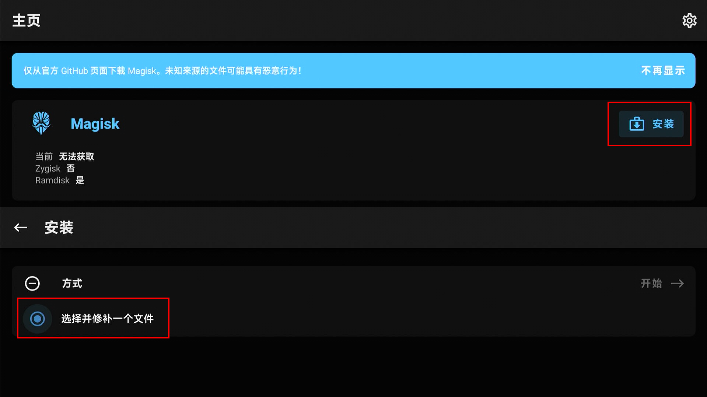
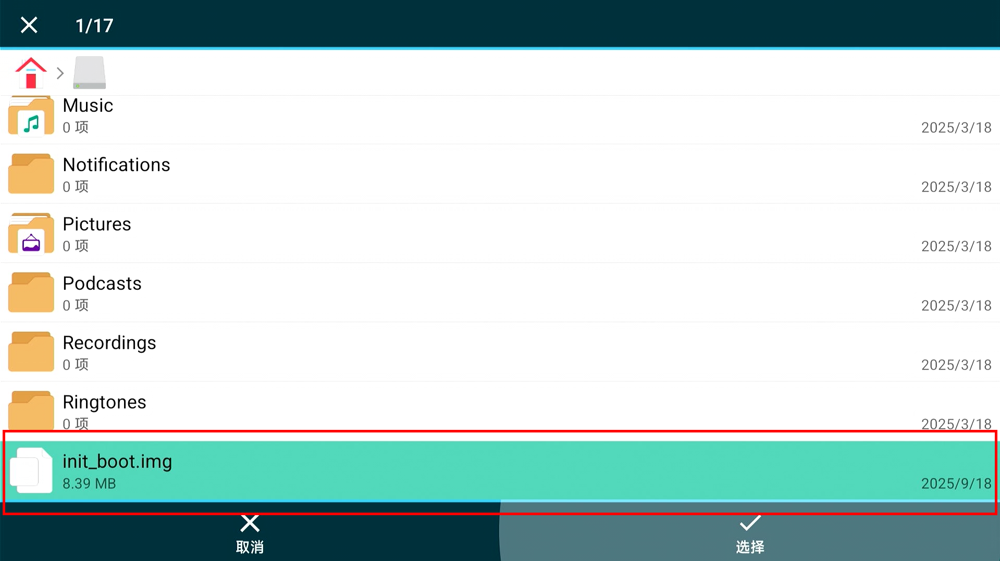
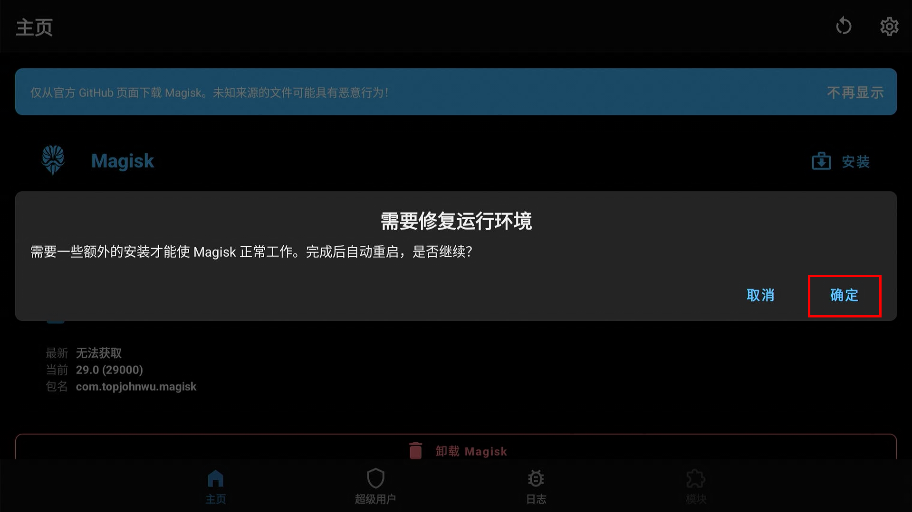
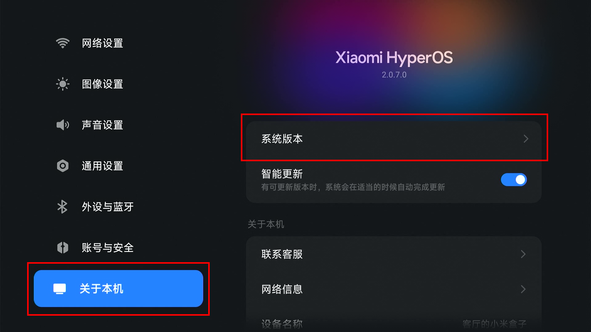

#  如何 Root 小米盒子 5 (MOB2MB-5P)
本教程介绍如何 Root 小米盒子 5 (MOB2MB-5P)。

> [!CAUTION]
> 对设备进行 Root 会导致设备面临各类安全风险，并可能对设备造成不可预估的影响，可能导致：
> - 硬件损坏
> - 设备永久性变砖
> - 失去官方保修资格
> - 设备被远程入侵
> - 数据被恶意软件清除或盗取
> - 无法正常接收或安装 OTA 系统更新
> - 某些应用检测到 Root 状态后拒绝运行
> 
> 在非必要情况下不建议执行此操作，如你选择继续则代表你已经充分了解并可自行承担全部风险，并自愿承担责任，作者对此操作产生的任何后果概不负责。

## 目录
- [小米盒子信息与额外说明](#小米盒子信息与额外说明)
- [前置要求](#前置要求)
- [提取 init_boot 镜像](#提取-init_boot-镜像)
- [修补并刷入 init_boot 镜像](#修补并刷入-init_boot-镜像)
- [~~额外内容: 保留 Root 来安装 OTA 更新 (可选-未实机验证-WIP)~~](#额外内容-保留-root-来安装-ota-更新-可选-未实机验证-wip)

## 小米盒子信息与额外说明
### 小米盒子信息
| 项目 | 内容 |
|------|------|
| 设备型号 | 小米盒子 5 (MOB2MB-5P) |
| SoC | Amlogic S905X5M |
| 系统版本 | OS2.0.7.0 (UD2A.240505.001.W1.OS2.0.7.0.UZFAABX) |
| Android 版本 | Android 14 |
| 安全补丁级别 | 2024-11-01 |
| Bootloader 版本 | 01.01.250317.222939 |
| 测试日期 | 2025 年 10 月 |
| 购买日期 | 2025 年 10 月 |
| 生产日期 | 2025 年 4 月 |

> [!WARNING] 
> ### 额外说明
> 本教程仅在上述版本中进行过完整测试。  
>
> 若你的设备信息与上表**存在差异**，则部分步骤可能会不适用或导致设备异常，请在充分了解风险后谨慎操作。

## 前置要求
- 小米盒子 5 (MOB2MB-5P) 一台（已解除 Bootloader 锁定）
- 一台电脑：Windows / Linux / macOS 均可
- 一条可靠的 USB 数据线 (请确保线缆为高质量数据线，而非仅支持充电的线缆。)
   - 若盒子与电脑均为 USB-A 接口，请使用 USB-A 公对 USB-A 公 数据线。
   - 若电脑拥有 USB-C 接口，也可使用 USB-A 公对 USB-C 公 数据线（即常见的手机数据线）。
- 下列 Android 应用安装包:
   - [Magisk](https://github.com/topjohnwu/Magisk) (用于修补 init_boot 镜像和 Root 完成后的权限管理)
   - [文件管理器+](https://play.google.com/store/apps/details?id=com.alphainventor.filemanager) (用于选择文件，你也可以尝试通过其他文件管理器来进行此操作，但由于 Android TV 14 的特殊性，无法保证其可用性)
- 电脑已安装下列工具：
   - [ADB & Fastboot 工具](https://developer.android.com/tools/releases/platform-tools)
   - [Android OTA 镜像解压工具](https://github.com/tobyxdd/android-ota-payload-extractor) (从`Release`中下载适用于你设备当前操作系统的最新版本)
   - **保证相关工具 / 驱动运行正常**

> [!TIP]
> ### 关于“文件管理器”兼容性
> 在 Android TV 14 上，多数文件管理器（包括 MT 管理器、ES文件浏览器、X-plore 等）在 Magisk 的 **“选择并修补一个文件”** 环节中，**无法正常弹出文件选择界面**。\
> 经过测试，目前 **“文件管理器+”** 是已知能在 Android TV 14 上被 Magisk 在此环节中正常调用的文件管理器之一。\
> 你也可以尝试其他具备相同能力的文件管理器，本文提及的应用仅为兼容性说明。

_※ 说明：_
- _本文档中提到的 “USB-C” 接口，即为日常生活中经常用到的 “Type-C” 接口。_
- _如果你的设备已经处于解锁状态，则无需执行本教程中与解锁相关的步骤。_
- _如果你的电视盒子还没有解除 Bootloader 锁定，那么请参阅教程：[如何解除 小米盒子 5 (MOB2MB-5P) 的 Bootloader 锁定](unlock_bootloader.md)。_
- _文件管理器+ 为可选应用_
   - _你可以尝试使用其他支持选择文件的文件管理器进行相关操作。_
   - _如果你了通过其他方法得到了兼容的并且已经被修补过的`init_boot`镜像，你也可以直接使用这个镜像，无需执行相关操作。_
   - _如果你选择使用通过其他方式获取已修补的`init_boot`镜像，作者无法保证其可用性或与电视盒子的兼容性。请在使用前自行验证镜像兼容性与安全性。_
- _Android OTA 镜像解压工具 为可选工具_
   - _你可以使用其他支持解包`payload.bin`的类似工具进行相关操作。_
   - _如果你了通过其他方法得到了兼容的`init_boot`镜像，你也可以直接使用这个镜像，无需从 OTA 包中提取。_
   - _如果你选择使用通过其他方式生成或获取的`init_boot`镜像，作者无法保证其可用性或与电视盒子的兼容性。请在使用前自行验证镜像兼容性与安全性。_

## 提取 init_boot 镜像
> [!NOTE]
> ### 说明:
> 目前一共有三种方法可以获得 init_boot 镜像，请根据实际情况来选择一个最适合自己的方法

### 方法一 : 通过 DSU 来进行提取

详细信息请参阅教程：[如何通过 DSU 来备份 小米盒子 5 (MOB2MB-5P) 的系统镜像](backup.md)

### 方法二 : 从全量 OTA 更新包中提取
> [!NOTE]
> ### 说明:
> 要使用此方法，你需要拥有匹配当前设备并且与设备系统版本一致的完整 OTA 更新包。\
> 解包可能需要一些时间，视文件大小与磁盘速度而定，请耐心等待。\
> 使用前，请先确认电脑上是否拥有足够的存储空间。

使用 Android OTA 镜像解压工具 解包你获得的完整 OTA 更新包中的 `payload.bin` ([点击此处来查看使用方法](https://github.com/tobyxdd/android-ota-payload-extractor))\
    解包完成后，你应该会获得以下文件:

   ```shell
   boot.img        init_boot.img  odm.img      system_dlkm.img  vbmeta.img         vendor_dlkm.img
   bootloader.img  odm_dlkm.img   oem.img      system_ext.img   vbmeta_system.img  vendor.img
   dtbo.img        odm_ext.img    product.img  system.img       vendor_boot.img
   ```

   <details>
   <summary>点击查看示例图片 (文件列表截取于 Windows)</summary>
   
   </details>

其中就有 Root 所需的 `init_boot.img` ，请妥善保管此镜像，以便于在后续操作的时候可以轻松的找到此镜像。

_※ 说明：列出的文件仅供参考，请以实际情况为准。_
### 方法三 : 从公开社区中寻找他人分享的 init_boot 镜像（不推荐）
> [!CAUTION]
> ### 注意:
> 在网络上找到的镜像可能是损坏的，又或者是不兼容你设备的，也有可能是包含恶意软件的，因此在常规情况下不建议使用通过这种方法获得的镜像。
>
> 如果确实要通过这种方法来获得镜像，那么请选择相对可靠的来源，并在下载前自行确认其兼容性与安全性。
> 
> 若你选择继续，则代表你已经充分了解并可自行承担全部风险，并自愿承担责任，作者对此操作产生的任何后果概不负责。

你可以尝试在网络上寻找别人分享的 init_boot 镜像。\
比如尝试在下列论坛中进行寻找:
 - [XDA 论坛](https://xdaforums.com/)
 - [4PDA 论坛](https://4pda.to/forum/index.php)
 - [恩山无线论坛 (网络机顶盒相关板块)](https://www.right.com.cn/forum/) 
 - [ZNDS智能电视网](https://www.znds.com/) 

_※ 说明：_
   - _本文仅为方便访问而列出这些论坛。_
   - _作者不为这些论坛中的任何内容提供担保。_

## 修补并刷入 init_boot 镜像
> [!NOTE]
> ### 注意
> 开始前，请确保电脑已正确安装并配置了 ADB 工具。
>
> 如需确认 adb 是否可用，请运行以下命令：
> ```shell
> adb --version
> ```
> 如果能正常显示版本号，即表示 ADB 已正确安装。如果没看到版本号，请确保 ADB 已正确安装。\
>如果你还不知道怎么样将电视盒子连接电脑至并授权 ADB，那么请参阅其他教程中的：[启用 ADB 调试 功能](unlock_bootloader.md#启用-adb-调试-功能) 和 [连接电脑并授权 ADB](unlock_bootloader.md#连接电脑并授权-adb) 章节。

1. 在电视盒子上安装下列应用并授予相关权限:
    - [Magisk](https://github.com/topjohnwu/Magisk)
    - [文件管理器+](https://play.google.com/store/apps/details?id=com.alphainventor.filemanager)

   你可以使用下列 ADB 命令进行安装:
    - 安装 Magisk 应用
      ```shell
      adb install <本地安装包文件路径> 
      # 使用示例: 安装电脑 D 盘 MiBox5 文件夹中的 Magisk.apk
      $ adb install "D:\MiBox5\Magisk.apk"
      # 期望返回的信息
      Performing Streamed Install
      Success
      ```
    - 安装 文件管理器+ 应用
      ```shell
      adb install <本地安装包文件路径> 
      # 使用示例: 安装电脑 D 盘 MiBox5 文件夹中的 File_Manager.apk
      $ adb install "D:\MiBox5\File_Manager.apk"
      # 期望返回的信息
      Performing Streamed Install
      Success
      ```

   _※ 说明：安装完成后建议先运行一次这些应用，以便应用申请必要权限。_

2. 禁用系统应用: Activity Stup

   你可以使用下列 ADB 命令进行禁用:
      ```shell
      adb shell pm disable-user --user 0 com.android.tv.frameworkpackagestubs
      # 期望返回的信息
      Package com.android.tv.frameworkpackagestubs new state: disabled-user
      ```

   _※ 说明：如果不禁用，在后续步骤中你将无法选择文件。_

3. 将 init_boot 镜像上传至设备

   你可以使用下列 ADB 命令进行上传:
      ```shell
      adb push <本地镜像文件路径> <电视盒子上的路径>
      # 使用示例: 将电脑 D 盘 \MiBox5\backups 文件夹中的 init_boot.img 上传到盒子的 /sdcard 目录
      $ adb push "D:\MiBox5\backups\init_boot.img" /sdcard
      # 期望返回的信息
      D:\MiBox5\backups\init_boot.img: 1...ile pushed, 0 skipped. 98.6 MB/s (8388608 bytes in 0.081s) 
      ```

4. 打开 Magisk 应用来修补 `init_boot` 镜像

   使用下列命令来打开 Magisk 应用:
      ```shell
      adb shell am start com.topjohnwu.magisk/com.topjohnwu.magisk.ui.MainActivity
      ```
   或是在应用列表中找到名称为 Magisk 的应用并打开

   

   进入 Magisk 应用主界面后点击 `安装 > 选择并修补一个文件`

   

   在打开的文件选择界面中找到并选择你上传的 init_boot 镜像

   

   选择完成后点击"开始"

   

   当安装过程完成后，你可以在安装界面提供的日志中找到已修补镜像的输出位置。\
   通常情况下，镜像会输出在`/storage/emulated/0/Download`目录中，镜像名为 `magisk_patched-[Magisk版本]_[随机字符串].img`

   在此教程中，输出的日志如下 (仅供参考) :
   ```log
   - Device platform: armeabi-v7a
   - Installing: 29.0 (29000)
   - Copying image to cache
   - Unpacking boot image
   - Checking ramdisk status
   - Stock boot image detected
   - Patching ramdisk
   - Pre-init storage partition: userdata
   - Repacking boot image

   ****************************
    Output file is written to 
    /storage/emulated/0/Download/magisk_patched-29000_exeo8.img 
   ****************************
   - All done!
   ```
   通过日志我们可以得知，修补过的镜像被输出到了`/storage/emulated/0/Download`目录中，镜像名为 `magisk_patched-29000_exeo8.img`

> [!TIP]
> 没有看到文件选择界面？ 请尝试按照以下几个方向来检查：
>
> * 检查是否禁用了 Activity Stup 应用。
> * 检查安装的文件管理器是否被授予必要权限。
> * 检查是否安装了具备文件选择能力并且兼容 Android TV 14 的文件管理器。

5. 使用 `adb pull` 命令将修补过的镜像导出至电脑
   ```shell
   adb pull <镜像在盒子上的位置> <镜像在你电脑上的导出位置>
   # 使用示例: 将盒子 /sdcard/Download 目录中的 magisk_patched-29000_exeo8.img 导出到电脑 D 盘 \MiBox5 目录中
   $ adb pull /sdcard/Download/magisk_patched-29000_exeo8.img D:\MiBox5
   # 期望返回的信息
   /sdcard/Download/magisk_patched-29000_exeo8.img: 1 file pulled, 0 skipped. 35.9 MB/s (8388608 bytes in 0.223s)
   ```
6. 使用下列命令将电视盒子重启到 Fastboot 模式中:
   ```shell
   adb shell reboot bootloader
   ```

7. 使用下列命令来刷入修补过的 `init_boot` 镜像:
   ```shell
   fastboot flash init_boot <镜像在你电脑上的位置>
   # 使用示例: 将电脑 D 盘 \MiBox5 文件夹中的 magisk_patched-29000_exeo8.img 刷入到盒子的 init_boot 分区中
   $ fastboot flash init_boot "D:\MiBox5\magisk_patched-29000_exeo8.img"
   # 期望返回的信息
   Sending 'init_boot_a' (8192 KB)                    OKAY [  2.049s]
   Writing 'init_boot_a'                              OKAY [  0.102s]
   Finished. Total time: 2.166s
   ```
8. 刷入完成后使用下列命令来重启设备
   ```shell
   fastboot reboot
   ```

9. 进入系统后，打开 Magisk 应用来确认安装状态

   如果提示需要修复环境，请点击确认，点击确认后系统将在5秒后自动重启。

   

***
至此，你已经完成所有安装过程

下图为正常安装的 Magisk 应用主界面


## ~~额外内容: 保留 Root 来安装 OTA 更新 (可选-未实机验证-WIP)~~

> [!CAUTION]
> ### 警告:
> 由于 小米盒子 5 截止至教程撰写前，仍未发布任何的 OTA 更新，导致没有办法进行相关测试\
> 这就代表了此章节的内容**目前没有经过任何实机验证**\
> 绝大多数信息都是通过结合已有信息猜测得到的，到时候的实际情况可能和此章节中假设的情况完全不同
> 
> 若你选择继续，则代表你已经充分了解并可自行承担全部风险，并自愿承担责任，作者对此操作产生的任何后果概不负责。

<details>
<summary>仍要继续？ 点击此处来查看相关内容</summary>

> [!NOTE]
> ### 说明:
> 小米盒子 5 使用了 A/B 系统更新 机制\
> 因此，在安装更新前需要进行一些额外操作才能保证 Root 在更新后也能够正常使用

> [!TIP]
> ### 什么是 A/B 系统更新?
> A/B 系统更新（也称为无缝更新）的目标是确保在无线下载 (OTA) 更新期间在磁盘上保留一个可正常启动和使用的系统。采用这种方式可以降低更新之后设备无法启动的可能性，这意味着用户需要将设备送到维修和保修中心进行更换和刷机的情况将会减少。
>
> 如需获取更多信息，请参阅: [Android Developers](https://source.android.com/docs/core/ota/ab)


如果你收到了 OTA 更新，请按照以下方法来进行操作
1. 打开设置，并转到 `关于本机 > 系统版本`

   

2. 点击"立即下载"，并等待更新下载并安装完成

   

   _※ 说明：此图片来自其他型号设备，仅供参考，请以实际情况为准。_

> [!NOTE]
> ### 注意:
> 下载并安装完成后先不要重启设备

3. 下载完成后退出更新界面并返回桌面，然后打开 Magisk 应用

   

   或是使用使用下列命令来打开 Magisk 应用:
   ```shell
   adb shell am start com.topjohnwu.magisk/com.topjohnwu.magisk.ui.MainActivity
   ```

4. 进入 Magisk 应用主界面后点击 `安装 > 安装到未使用的槽位 (OTA后) > 开始`

   

   点击后系统将自动执行安装安装过程，并在界面中显示安装日志
   
5. 重新打开系统更新界面，并点击重启

6. 进入系统后，打开 Magisk 应用来确认安装状态

***
至此，你已经完成 OTA 更新过程

下图为正常安装的 Magisk 应用主界面


_※ 说明：_
- _A/B 系统更新 的介绍引自 [Android Developers](https://source.android.com/docs/core/ota/ab)。_
- _若更新后 Magisk 状态异常，可尝试重新备份并修补新版本的 init_boot.img 来刷入，以恢复 Root。_

> [!CAUTION]
> ### 警告:
> 由于 小米盒子 5 截止至教程撰写前，仍未发布任何的 OTA 更新，导致没有办法进行相关测试\
> 这就代表了此章节的内容**目前没有经过任何实机验证**\
> 绝大多数信息都是通过结合已有信息猜测得到的，到时候的实际情况可能和此章节中假设的情况完全不同
> 
> 若你选择继续，则代表你已经充分了解并可自行承担全部风险，并自愿承担责任，作者对此操作产生的任何后果概不负责。

</details>